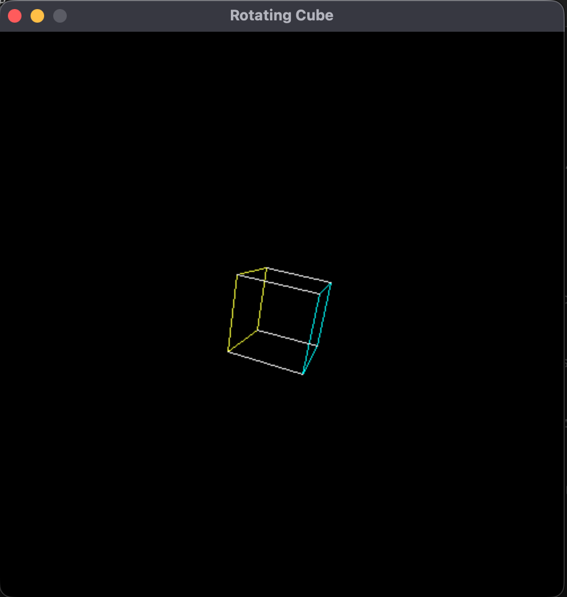

# Rotating Cube animation!

I was inspired by Daniel Hirsch's video on animating a spinning cube in 3D and wanted to make my own version without looking at his solution in C++!

> Quick side note: I am learning C++ and am aroud 20 pages into Bjarne Stroustrup's _A Tour of C++_, so my implementation is far from good! I mainly tried focusing on using and implementing abstraction offered by C++, throuhg use of coherent types, and functions, and function overloading.

I was exposed to a lot of cool math for this project! I was introduced to perspective projection and rotation matrices!

## Brief overview of the math

In my development, I figured it would be useful to represent the cube through an array of 3D points, each of which could then be mapped down to a 2D screen. The main issue, then, was figuring out how to project from 3D to 2D.

Ultimately, I used perspective projection:

Now, this diagram looked like a spaceship to me at first, and I had no idea what was going on at all. However, it is actually quite simple. In order to map 3D points to a 2D screen, we need to know a couple of things:

1. Camera position
2. Focal Length, or the distance between the camera and the screen that we are projecting on (labeled image plane on diagram)
3. The coordinates of the 3D points themselves.

We will use a standard 3D coordinate system defined by X, Y, and Z.

For simplicity, we will set the camera to the origin of the coordinate system, and point it along the Z axis. This makes our Z-axis what is called the _principal_ axis.

We need to figure out how far the screen is. This was the most challenging step for me, conceptually. I did not understand the difference between the projected screen, and the actual screen of the computer that we are rendering on. I was confused by their distinction, and what the camera actually means.

However, it is quite simple. We define the SDL window to be of a certain `WIDTH` and `HEIGHT`. Then, we define what is called the **field of view**. This is semantically equivalent to the FOV of a real camera, and determines the angle of our triangles that we see on the right side of the diagram.

Using this, we can figure out or **focal length**. Note that the top ray of the FOV must intersect the top of the screen. Now what is the height of our screen? Why, it is defined by our `HEIGHT` variable!

> Note that you actually have to set the intersection as half of the angle intersects with half of the height, as, like the diagram suggests, we consider on the top half of the side view.

Using trig identities and the definition of tangents, we see that:

$`
\begin{align}
tan(\frac{\theta}{2}) = \frac{HEIGHT}{f}\\
f = \frac{HEIGHT}{tan(\frac{\theta}{2})}
\end{align}
`$

We now figured out the focal length! Awesome, lets now figure out the transformed x' and y' positions. Note that the x and y cases are symmetrical, as it doesn't matter which way we construct the triangles shown in the right part of the image.

Notice, that the triangles on the right side of the image are similar, and the following holds (for both x and y, symmetrically):

$`
\begin{align}
\frac{y}{z} = \frac{y'}{f}\\
y' =\frac{fy}{z} \rightarrow x'=\frac{fx}{z}
\end{align}
`$

Awesome!! What this semantically means is that if we take the ratio of the focal length to the z distance away from the camera (along our **principal** axis), and mulitply it by our original coordinate, we get its mapped representation!! Let's sanity check:

For really large z (objects that are very far away), our mapped coordinate goes to 0, which makes sense! The further away something is, the more it looks like a tiny pinhole. Now if our z is really small, (object is close), our fraction blows, suggesting that close objects are bigger!

Now one last thing that I had to figure out was offsetting the projection to the SDL Window. SDL tracks x=0, y=0 at the top left corner of the window, but we want to offset that by `WIDTH/2 - width_of_cube/2`, `HEIGHT/2 - width_of_cube/2` to center our final image.

## Rotation

Rotation is rather simple! We just have to use the following matrices, and mutiply each of our points (3D vector) by it:

> Now note that we translated the object out by along the Z axis to be behind our screen, so we must bring it around to origin to use these rotation matrices, and then bring them back to their original spot

Now, on every frame, apply this matrix with a theta parameter, and watch it rotate!!!!

This was so cool, was super duper fun.
