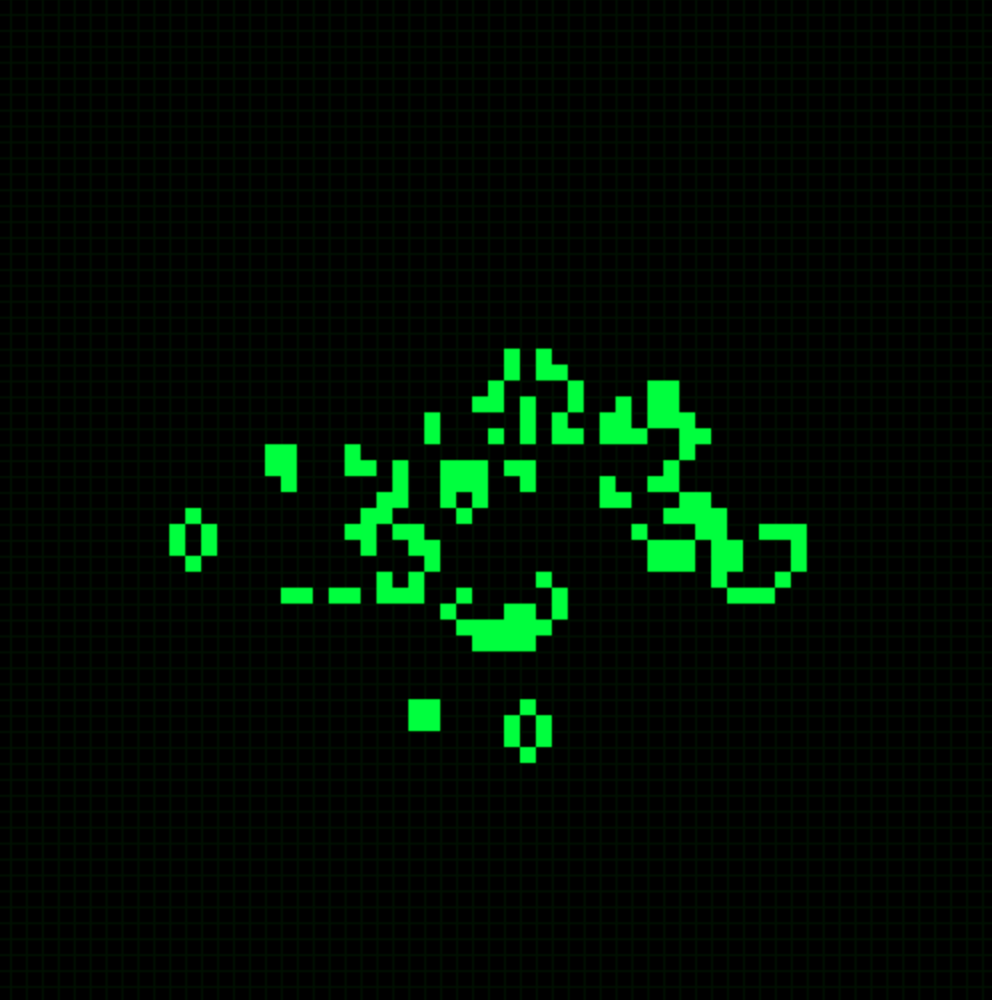

# Conway's Game of Life mini project in C

## Background

Conway's Game of Life is a cellular automation game that
was invented by John Conway. Its significance largely rises from the fact that simple rules can lead to complicated emergent behavior.

## Rules

The game consists of a grid of squares called cells. Each cell can be in one of two states: `alive` or `dead`.
The game follows the following two rules:

1. If a cell is alive, it stays alive on the next round only if it has two or three living neighbors.
2. If a cell is dead, it comes to life on the next round only if it has 3 living neighbors.

Even though these rules seem simple, they are responsible for some fascinating behaviors and patterns.

> Here's a link for some more info: https://conwaylife.com/wiki/

## Development:

I love C programming because of its simplicity, so I wanted to take on this cute project to reinforce my C abilities and work with a visualization tool for the langauge. I chose to use `SDL3` for this purpose, as I was inpsired by this YouTuber: https://www.youtube.com/@HirschDaniel

The code is otherwise pretty straightforward. I should pay attention to efficency more, but I'm still learning!

## Screenshot:

